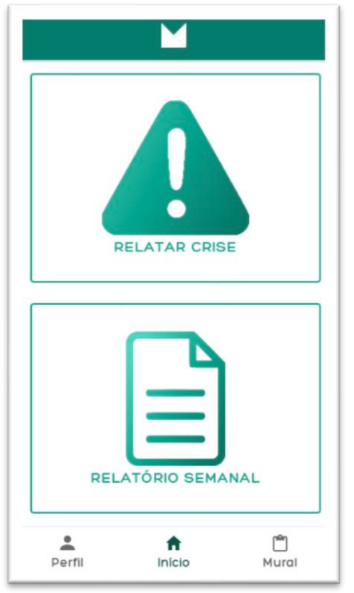
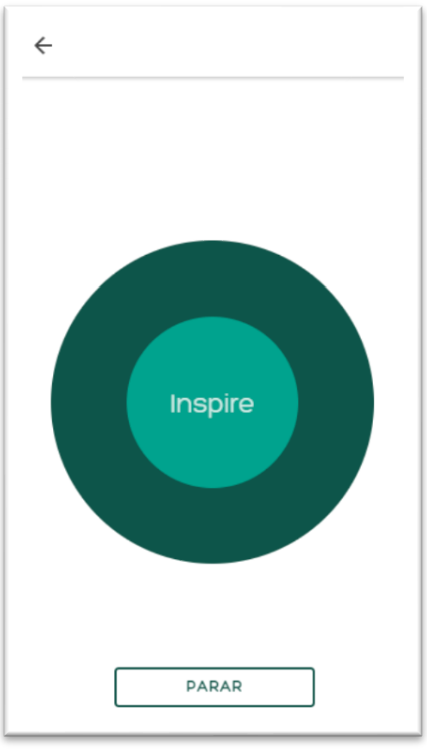
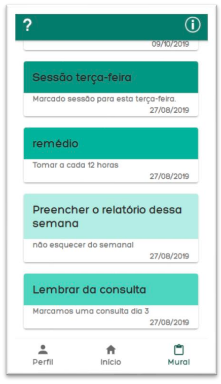
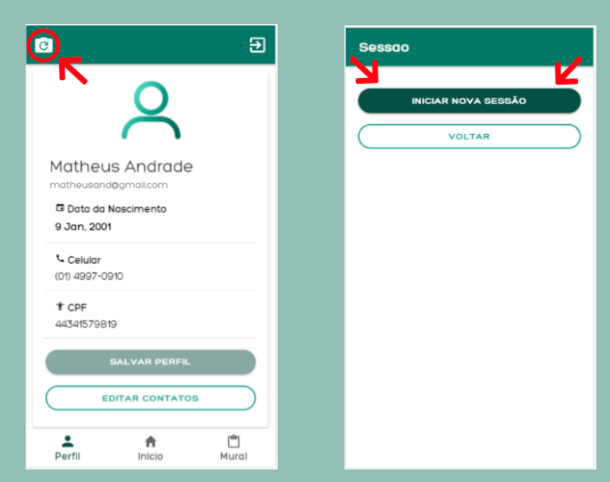
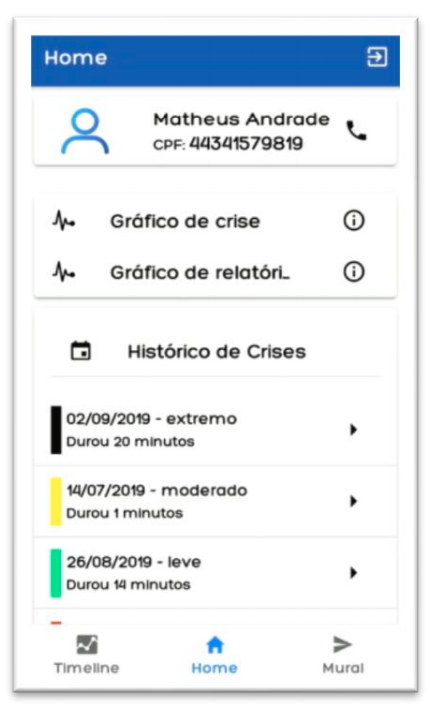
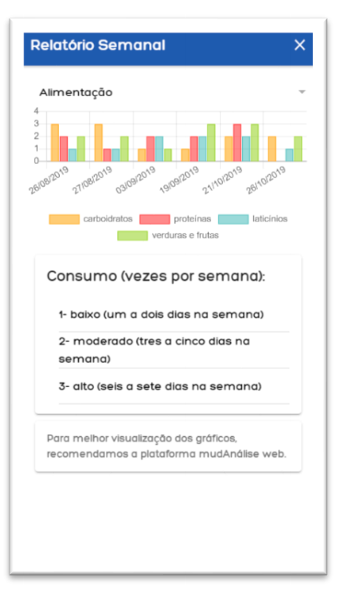
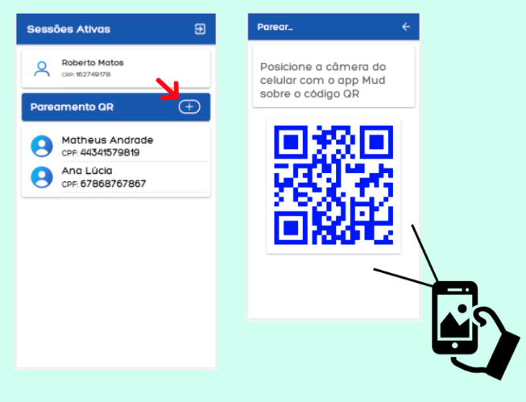
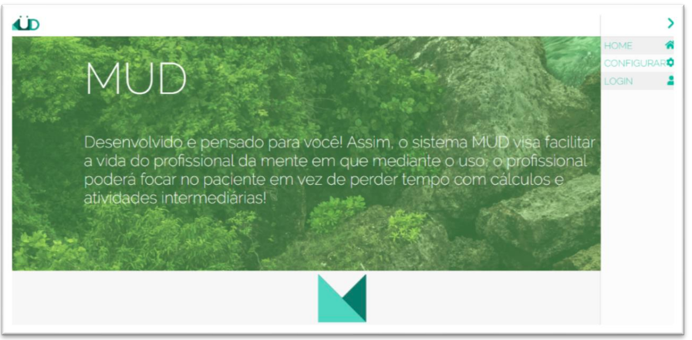
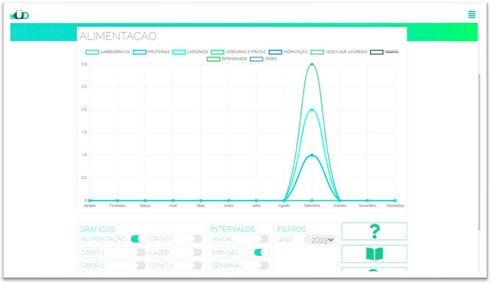
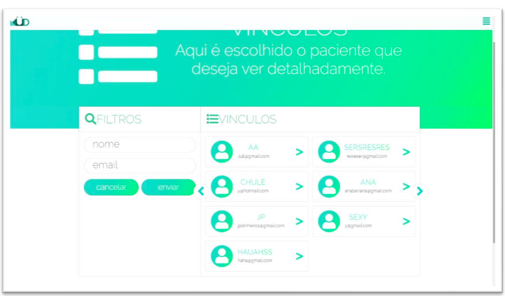

<h1 align="center">
    
    <!--      -->
     
    Müd
</h1>
<h2>Overview</h2>

<h4 text-align="left">
🇺🇸 Müd is a mobile and desktop application to manage Panic Syndrome Patients. This Ionic-4, PHP and Javascript-based project is also the Final paper for the Technical Diploma of Informatics course at CTI-UNESP (Class of 2019).
  
🇧🇷 Müd é uma aplicação mobile e desktop com o intuito de gerenciar pacientes de Síndrome do Pânico. Este projeto, baseado em PHP, Ionic-4 e Javascript, é também o TCC do curso técnico em Informática do CTI-UNESP (Turma de 2019).
</h4>

---

## Documentation (Brazilian Portuguese Only)
- Click [here](https://github.com/bibarTheDev/TCC-lindo/blob/master/docs/userguide_ptbr.pdf) to access our User Guide. 

- The official technical documentation for Müd (70 pages) can be found [here](https://github.com/bibarTheDev/TCC-lindo/blob/master/docs/official_documentation_ptbr.pdf).

- We also created a 2-min presentation video on YouTube. You can watch it [here](https://www.youtube.com/watch?v=fbGaaIRO73Q)

## Relevant User Interface
Müd is divided in three different integrated apps: a mobile app aimed to the patient, a mobile app aimed for the professional and a desktop-based dashboard also for the professional. Each of the three components can be connected to each other through a simple QR-code pairing method.

### 1: Patient-oriented App

    
    <figcaption>Patient Homepage</figcaption>
     
    
    <figcaption>Breathing Technique</figcaption>
     
      
    <figcaption>Message Board</figcaption>
     
      
    <figcaption>Pairing Tutorial</figcaption>
     

### 2: Professional-oriented App

    
    <figcaption>Pro Homepage</figcaption>
     
    
    <figcaption>Patient Graphs</figcaption>
     
      
    <figcaption>Pairing Tutorial</figcaption>
     

### 3: Desktop Dashboard

    
    <figcaption>Dashboard Homepage</figcaption>
     
    
    <figcaption>Patient Graphs (more complex than the mobile ones)</figcaption>
     
      
    <figcaption>Paired Patients Page</figcaption>
     

---
### Want to see more?

For the complete collection of Müd interfaces, please check out the official [documentation](https://github.com/bibarTheDev/TCC-lindo#documentation-brazilian-portuguese-only).

## Contributing
Pull requests are welcome. For major changes, please open an issue first to discuss what you would like to change.

Please make sure to update tests as appropriate.

## License
[GNU GENERAL PUBLIC LICENSE](https://choosealicense.com/licenses/agpl-3.0/)

## Repo Metadata

